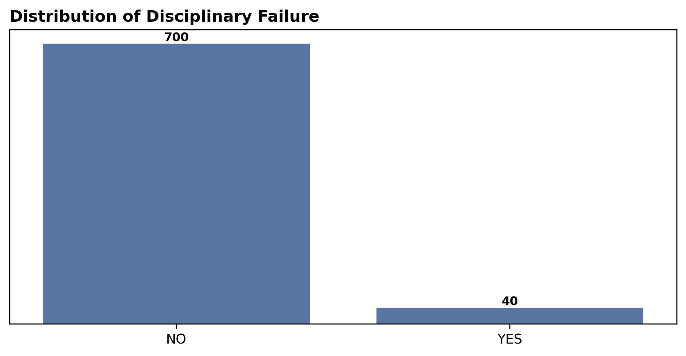

# 📊 Absenteeism at Work — Predictive Classification
> 🇧🇷 Versão em Português disponível abaixo.

## 📌 Description

This project investigates **workplace absenteeism** using the public dataset **Absenteeism at Work** from the **UCI Machine Learning Repository**.  
The objective was to develop a **Multiclass Logistic Regression** model capable of classifying absence levels — **None**, **Moderate**, and **High** — based on organizational, personal, and occupational variables.

The study involved:  
- **Exploratory Data Analysis (EDA):** understanding absence distributions, seasonal patterns, and variable correlations;  
- **Preprocessing:** recategorization of absence reasons, normalization, and variable encoding;  
- **Modeling:** comparison between original unbalanced data and balanced data using **SMOTE**;  
- **Evaluation:** assessment through metrics such as **accuracy**, **precision**, **recall**, **F1-score**, and **confusion matrix** for each class.  

---

## 📊 Results

- The initial model (original data, `class_weight=balanced`) achieved an overall **accuracy of 59.5%**, with solid performance for the **Moderate** class but lower precision for **No Absence**.  
- After applying **SMOTE**, global accuracy improved to **61%**, with enhanced performance for minority classes:  
  - Class 0 (No Absence): F1 = 0.27, Recall = 0.67  
  - Class 1 (Moderate Absence): F1 = 0.67  
  - Class 2 (High Absence): F1 = 0.68  
- The comparison of correct and incorrect predictions showed consistent improvements across all classes after balancing.  

**Performance Comparison (Original vs Balanced):**

| Class | Correct (Original) | Incorrect (Original) | Correct (Balanced) | Incorrect (Balanced) |
|--------|---------------------|----------------------|---------------------|----------------------|
| 0 (No Absence)   | 7  | 2  | 6  | 3  |
| 1 (Moderate)     | 45 | 38 | 48 | 35 |
| 2 (High)         | 36 | 20 | 37 | 19 |

---

## 📈 Visualizations

  

---

💡 *Note:* This project is part of an academic study on predictive modeling for human resources analytics, combining data preprocessing, model evaluation, and class balancing techniques.  

---

## 📌 Conclusão
- A **Regressão Logística Multiclasse** mostrou-se eficaz e **interpretável**, ainda que com acurácia moderada.  
- O uso de **SMOTE** foi decisivo para melhorar o desempenho em classes menos representadas.  
- Apesar das limitações, o modelo fornece **insights acionáveis para gestão de pessoas**, permitindo identificar padrões de ausência e apoiar estratégias organizacionais.
